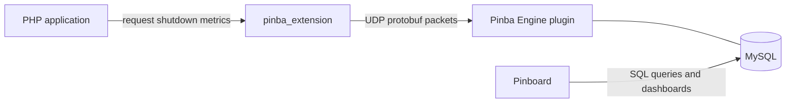

# Pinba Extension (Modernization Fork)

[](https://github.com/XOlegator/pinba_extension/actions/workflows/ci.yml)
[](https://github.com/XOlegator/pinba_extension/actions/workflows/lint.yml)
[](https://codecov.io/gh/XOlegator/pinba_extension)
[](https://github.com/XOlegator/pinba_extension/releases/latest)
[](https://packagist.org/packages/xolegator/pinba_extension)
[](https://copr.fedorainfracloud.org/coprs/xolegator/pinba/)
[](https://github.com/XOlegator/pinba_extension/blob/master/.github/php-versions.json)
[](https://github.com/XOlegator/pinba_extension/blob/master/COPYING)

Pinba Extension is the PHP client extension for the Pinba monitoring stack. It collects timing
and request metrics inside PHP, serializes them with protobuf, and sends them over UDP to
Pinba Engine.

This repository is an actively maintained fork of the original project:

- Original project: [tony2001/pinba_extension](https://github.com/tony2001/pinba_extension)
- Active fork: [XOlegator/pinba_extension](https://github.com/XOlegator/pinba_extension)

## Where This Project Fits



Short version:

- `pinba_extension` lives inside PHP applications and produces runtime metrics.
- `pinba_engine` receives those metrics over UDP and exposes them through MySQL tables.
- `pinboard` reads aggregated and raw data from MySQL and presents it to users.

## Fork Goals

The purpose of this fork is to take over active development and make the extension usable on
modern systems again.

Current development direction:

- support modern PHP versions and current Zend APIs;
- replace obsolete build and test workflows with reproducible automation;
- add CI for build, lint, tests, and packaging;
- add Debian and Launchpad packaging for supported Ubuntu releases;
- automate rebuilds when new supported PHP versions appear;
- preserve wire compatibility with the existing Pinba protocol and ecosystem.

## Installation

### From the PPA (Ubuntu, recommended)

Prebuilt packages are published to the
[`ppa:xolegator/packages`](https://launchpad.net/~xolegator/+archive/ubuntu/packages) Launchpad PPA:

```bash
sudo add-apt-repository ppa:xolegator/packages
sudo apt-get update
sudo apt-get install php8.5-pinba   # also available: php8.4-pinba, php8.3-pinba, php8.2-pinba
```

Availability per Ubuntu release: 24.04 `noble` ships `php8.2`–`php8.5`; 26.04 `resolute` ships `php8.5`.

The package installs the extension and enables it (`phpenmod`). Set the runtime options in a
drop-in such as `/etc/php/<version>/mods-available/pinba.ini` (or a separate `conf.d` file), then
reload the SAPI:

```ini
pinba.enabled = 1
pinba.server  = 127.0.0.1:30002
```

```bash
sudo systemctl restart php8.5-fpm   # for FPM; CLI picks the new config up automatically
```

### From the Copr repo (Fedora and Enterprise Linux)

Prebuilt packages are published to the
[`xolegator/pinba`](https://copr.fedorainfracloud.org/coprs/xolegator/pinba/) Copr repository for
Fedora and Enterprise Linux 9/10 (AlmaLinux, Rocky, RHEL, CentOS Stream). Two package families are
available from the same repo.

#### Distro-native PHP (`php-pinba`, no Remi)

For the PHP that ships in your distribution's own repositories — **Remi is not required**:

```bash
sudo dnf copr enable xolegator/pinba
sudo dnf install php-pinba
```

This builds for the OS's default PHP (Fedora 43 → 8.4, Fedora 44 → 8.5, Enterprise Linux 9 → 8.1
from AppStream, Enterprise Linux 10 → 8.3) and ships its ini at `/etc/php.d/40-pinba.ini`.

#### Multiple PHP versions via Remi (SCL `php<XY>-php-pinba`)

To install the extension for a specific Remi PHP collection, **Remi must be enabled** — these
packages depend on `php<XY>-php-common` from it.

Enable Remi on Fedora:

```bash
sudo dnf install -y dnf-plugins-core
sudo dnf install -y "https://rpms.remirepo.net/fedora/remi-release-$(rpm -E %fedora).rpm"
```

…or on Enterprise Linux 9/10:

```bash
sudo dnf install -y dnf-plugins-core epel-release
sudo dnf install -y "https://rpms.remirepo.net/enterprise/remi-release-$(rpm -E %rhel).rpm"
```

Then enable the Copr repo and install the build for your PHP version:

```bash
sudo dnf copr enable xolegator/pinba
sudo dnf install php84-php-pinba   # also available: php82-php-pinba, php83-php-pinba, php85-php-pinba
```

These are Remi SCL packages, so each installs into its collection and ships its ini at
`/etc/opt/remi/php<XY>/php.d/40-pinba.ini`.

#### Runtime options

Set the runtime options in the ini file shipped by whichever package you installed:

```ini
pinba.enabled = 1
pinba.server  = 127.0.0.1:30002
```

### From source

```bash
phpize
./configure --enable-pinba
make -j"$(nproc)"
sudo make install
```

This requires the matching `php<version>-dev` and `libprotobuf-c-dev` packages. See
[docs/build.md](docs/build.md) for the full local build and test flow.

### Docker and other distributions

Outside Debian/Ubuntu the extension is built from source against the system protobuf-c runtime.
Install the build toolchain and the protobuf-c development headers for your platform:

- Debian / Ubuntu: `libprotobuf-c-dev`
- Fedora / RHEL: `protobuf-c-devel`
- Alpine: `protobuf-c-dev`

**Docker (official PHP images)** — build and enable the extension in your image:

```dockerfile
FROM php:8.5-fpm

RUN apt-get update \
 && apt-get install -y --no-install-recommends $PHPIZE_DEPS git libprotobuf-c-dev \
 && git clone --depth 1 https://github.com/XOlegator/pinba_extension.git /usr/src/pinba \
 && cd /usr/src/pinba \
 && phpize && ./configure --enable-pinba && make -j"$(nproc)" && make install \
 && docker-php-ext-enable pinba \
 && rm -rf /usr/src/pinba /var/lib/apt/lists/*

RUN printf "pinba.enabled=1\npinba.server=pinba-engine:30002\n" \
      > "$PHP_INI_DIR/conf.d/zz-pinba.ini"
```

`$PHPIZE_DEPS` and `$PHP_INI_DIR` are provided by the official `php` images. For a slimmer image
you may `apt-get purge $PHPIZE_DEPS` afterwards, but keep the runtime `libprotobuf-c1`.

**PIE (PHP Installer for Extensions)** — this repository ships [PIE](https://github.com/php/pie)
metadata (`composer.json` with `"type": "php-ext"`) and is published to
[Packagist](https://packagist.org/packages/xolegator/pinba_extension), so the extension can be
installed cross-platform with:

```bash
pie install xolegator/pinba_extension
```

PIE still compiles from source, so it needs the same build toolchain and `libprotobuf-c` headers
as a manual source build.

## Development Baseline

The active CI matrix builds the extension and runs the PHPT suite on `PHP 8.2`, `8.3`, `8.4`,
and `8.5`, and enforces workflow, shell, and markdown linting plus `clang-format` and
`clang-tidy` in GitHub Actions. The PHP matrix source of truth is `.github/php-versions.json`,
and scheduled discovery automation refreshes it through PRs. Build-from-source steps are covered
under [Installation](#from-source) and [docs/build.md](docs/build.md).

## Documentation

- Development workflow and branch/commit rules: [docs/development.md](docs/development.md)
- Local build and test workflow: [docs/build.md](docs/build.md)
- Packaging direction and package naming: [docs/packaging.md](docs/packaging.md)
- Supported platforms and lifecycle policy: [docs/support-matrix.md](docs/support-matrix.md)
- Release process and automatic changelog flow: [docs/releasing.md](docs/releasing.md)
- Historical legacy release notes (curated): [docs/legacy-news.md](docs/legacy-news.md)
- Verbatim upstream `NEWS` archive: [docs/legacy-upstream-news.md](docs/legacy-upstream-news.md)
- Contribution guide: [CONTRIBUTING.md](CONTRIBUTING.md)
- Security policy: [SECURITY.md](SECURITY.md)
- Support policy: [SUPPORT.md](SUPPORT.md)
- Shared Pinba knowledge base: [XOlegator/pinba_engine/knowledge](https://github.com/XOlegator/pinba_engine/tree/master/knowledge)

## Release Process

This fork uses a semi-automated GitHub release flow:

- regular work is merged to `master` through Pull Requests;
- PR titles and commits must follow Conventional Commits;
- accepted changes are accumulated into `CHANGELOG.md` automatically;
- release PRs, version bumps, tags, and GitHub Releases are managed by automation.

Historical upstream notes remain in `docs/legacy-news.md` and `docs/legacy-upstream-news.md`;
all new fork release history belongs in `CHANGELOG.md`.

## License

This fork inherits the original project license and remains available under the
[GNU Lesser General Public License v2.1 or later](LICENSE).

Copyright:

- 2009-2013 Antony Dovgal
- 2026-present Oleg Ekhlakov

Provenance and third-party dependency notices are documented in [NOTICE](NOTICE), and project
authorship in [AUTHORS](AUTHORS).
