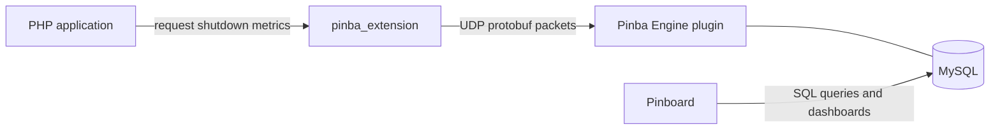

# Pinba Extension (Modernization Fork)

Pinba Extension is the PHP client extension for the Pinba monitoring stack. It collects timing
and request metrics inside PHP, serializes them with protobuf, and sends them over UDP to
Pinba Engine.

This repository is an actively maintained fork of the original project:

- Original project: https://github.com/tony2001/pinba_extension
- Active fork: https://github.com/XOlegator/pinba_extension

## Where This Project Fits



Short version:

- `pinba_extension` lives inside PHP applications and produces runtime metrics.
- `pinba_engine` receives those metrics over UDP and exposes them through MySQL tables.
- `pinboard` reads aggregated and raw data from MySQL and presents it to users.

## Fork Goals

The purpose of this fork is to take over active development and make the extension usable on
modern systems again.

Current development direction:

- support modern PHP versions and current Zend APIs;
- replace obsolete build and test workflows with reproducible automation;
- add CI for build, lint, tests, and packaging;
- add Debian and Launchpad packaging for supported Ubuntu releases;
- automate rebuilds when new supported PHP versions appear;
- preserve wire compatibility with the existing Pinba protocol and ecosystem.

## Current Repository State

The repository still largely reflects the legacy PECL-era layout:

- classic `config.m4` build flow;
- legacy `README`, `NEWS`, and `package.xml` metadata;
- one legacy PHPT test;
- bundled protobuf runtime sources.

The next phase of work is modernization around this codebase rather than a full rewrite.

## Development Baseline

Expected classic build flow:

```bash
phpize
./configure
make -j"$(nproc)"
make test
```

Future work in this fork will add a documented multi-version build matrix, static analysis, and
distribution packaging.

## Documentation

- Development workflow and branch/commit rules: [docs/development.md](docs/development.md)
- Release process and automatic changelog flow: [docs/releasing.md](docs/releasing.md)
- Historical legacy release notes: [docs/legacy-news.md](docs/legacy-news.md)
- Shared Pinba knowledge base: https://github.com/XOlegator/pinba_engine/tree/master/knowledge

## Release Process

This fork uses a semi-automated GitHub release flow:

- regular work is merged to `master` through Pull Requests;
- PR titles and commits must follow Conventional Commits;
- accepted changes are accumulated into `CHANGELOG.md` automatically;
- release PRs, version bumps, tags, and GitHub Releases are managed by automation.

Historical upstream notes remain in `NEWS` and `docs/legacy-news.md`; all new fork release
history belongs in `CHANGELOG.md`.

## License

This fork inherits the original project license and remains available under the
[GNU Lesser General Public License v2.1 or later](LICENSE).

Copyright:

- 2009-2013 Antony Dovgal
- 2026-present Oleg Ekhlakov

Additional bundled third-party code notices are documented in [NOTICE](NOTICE).
